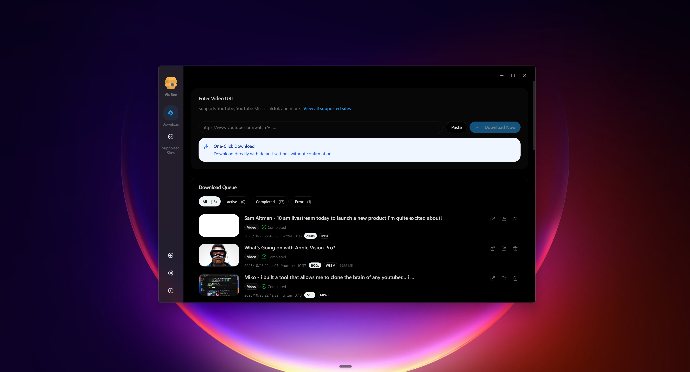
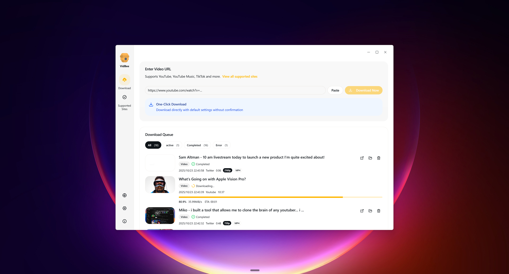

# 🐝 VidBee

<div align="center">
  
  <h3>Download videos from almost any website worldwide</h3>
  <p>Best-in-class UI interface - Clean, intuitive, and powerful</p>
  <p>Built with Electron, React, TypeScript, Tailwind CSS, and shadcn/ui.</p>
</div>

## ✨ Core Features

### 🌍 Global Video Download Support

- **1000+ Sites Supported** - Download videos from almost any website worldwide through yt-dlp engine
- **Smart Platform Detection** - Automatically detect video platforms and optimize download parameters
- **Multi-format Support** - Videos, audio tracks, playlists to meet all download needs
- Localized interface support in many languages

### 🎨 Best-in-class UI Experience

- **Modern Design** - Clean and beautiful interface
- **Intuitive Operations** - One-click pause/resume/retry
- **Real-time Progress** - Detailed download progress tracking and status management
- **Theme Switching** - Support for system/light/dark themes for comfortable viewing

## 📥 Download & Install

1. **Download the latest release** from [GitHub Releases](https://github.com/nexmoe/VidBee/releases)
2. **Choose your platform**:
   - **Windows**: Download `vidbee-x.x.x-setup.exe`
   - **macOS**: Download `vidbee-x.x.x.dmg`
   - **Linux**: Download `vidbee-x.x.x.AppImage`
3. **Install and run** the application

### 🍎 macOS Installation Notes

After downloading and installing VidBee on macOS, you may encounter a "file is damaged" error when trying to run the application. This is due to macOS security restrictions on applications downloaded from the internet.

```bash
xattr -rd com.apple.quarantine /Applications/VidBee.app/
```

This command removes the quarantine attribute that macOS applies to applications downloaded from the internet, allowing VidBee to run properly without the "file is damaged" error.

## 📸 Screenshots


*Clean and intuitive interface with download queue management*


*Comprehensive download queue with progress tracking and status management*

## 🌐 Supported Sites

VidBee supports hundreds of video and audio platforms through yt-dlp. Here are the most popular platforms:

| Video Platforms | Audio & Other Platforms |
| --- | --- |
| YouTube | YouTube Music |
| TikTok | SoundCloud |
| Facebook | Mixcloud |
| Instagram | Bandcamp |
| X (Twitter) | Reddit |
| Vimeo |  |
| Dailymotion |  |
| Twitch |  |
| LinkedIn |  |
| Pinterest |  |
| Tumblr |  |
| Niconico |  |
| Kick |  |

> **💡 Note:** VidBee uses [yt-dlp](https://github.com/yt-dlp/yt-dlp) under the hood, which supports 1000+ sites. For the complete list, visit the [yt-dlp supported sites documentation](https://github.com/yt-dlp/yt-dlp/blob/master/supportedsites.md).

## ?? Contributing

Please read [`CONTRIBUTING.md`](CONTRIBUTING.md) for guidelines on reporting issues, proposing features, and opening pull requests. It also covers the tech stack, development workflow, scripts, internationalization notes, configuration guidance, and packaging steps.

## 📄 License

This project is distributed under the MIT License. See `LICENSE` for details.

## 🙏 Thanks

- [yt-dlp](https://github.com/yt-dlp/yt-dlp)
- [Electron](https://www.electronjs.org/)
- [React](https://react.dev/)
- [Vite](https://vitejs.dev/)
- [Tailwind CSS](https://tailwindcss.com/)
- [shadcn/ui](https://ui.shadcn.com/)
